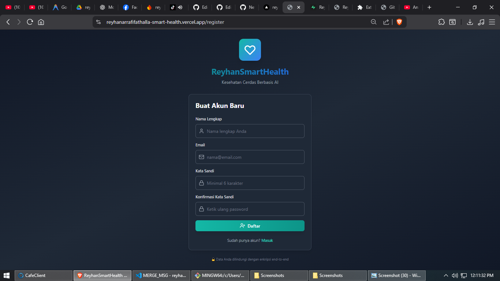
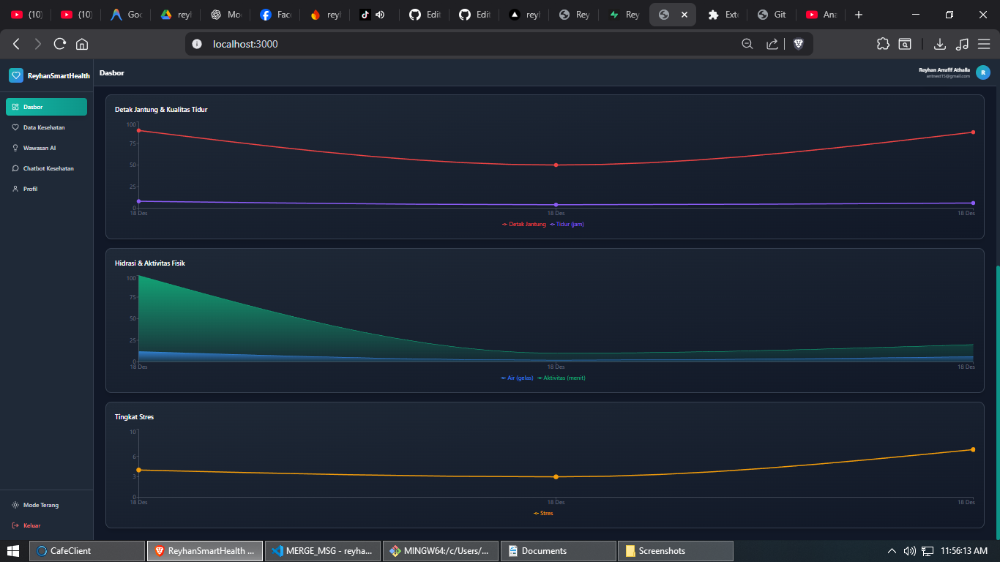
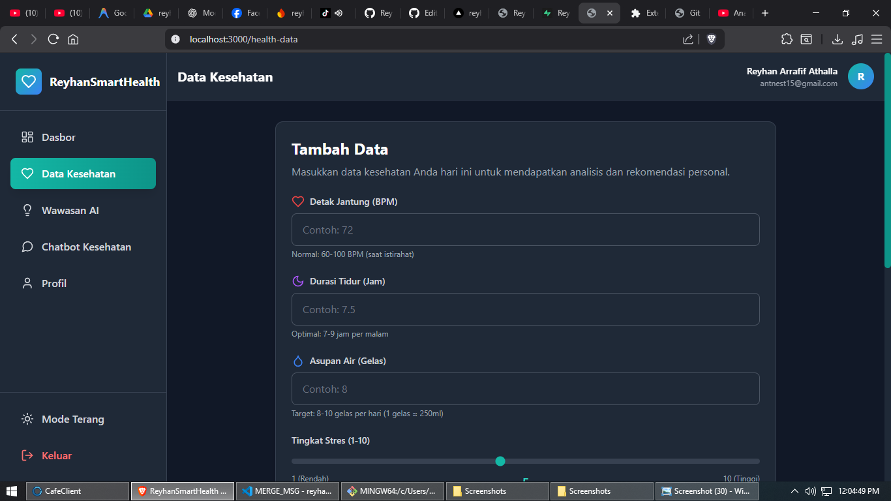
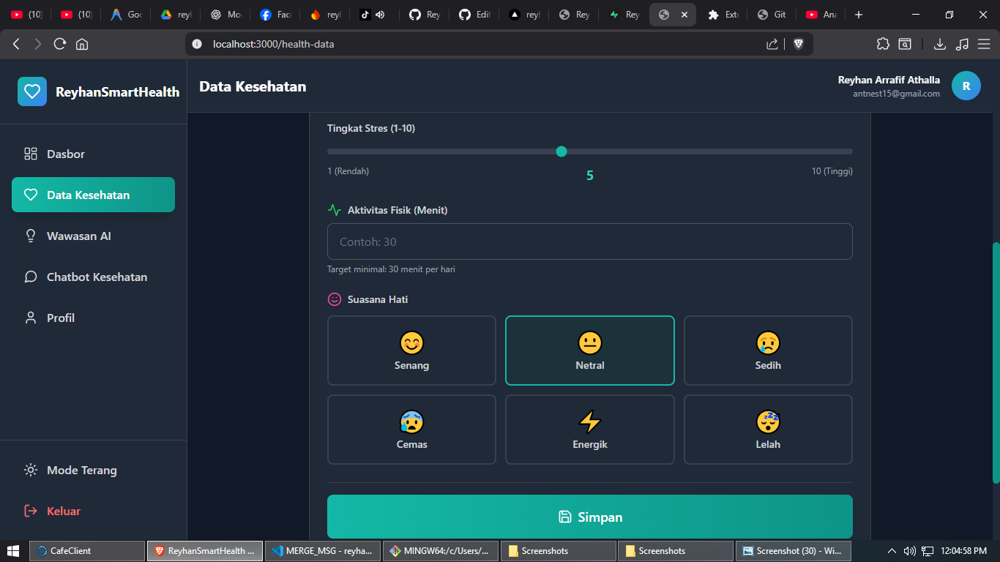
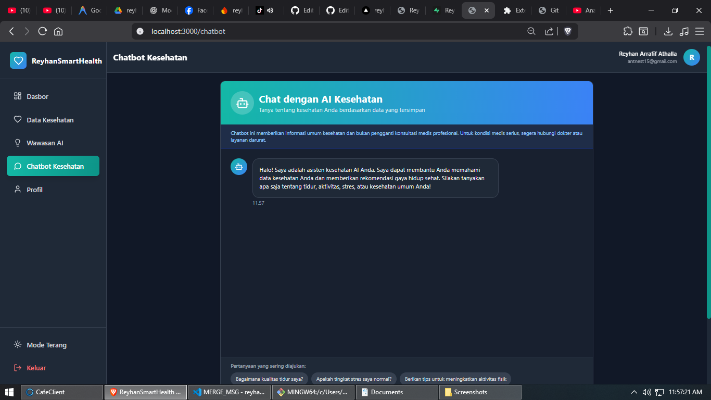
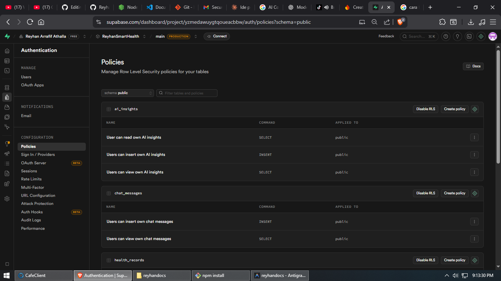
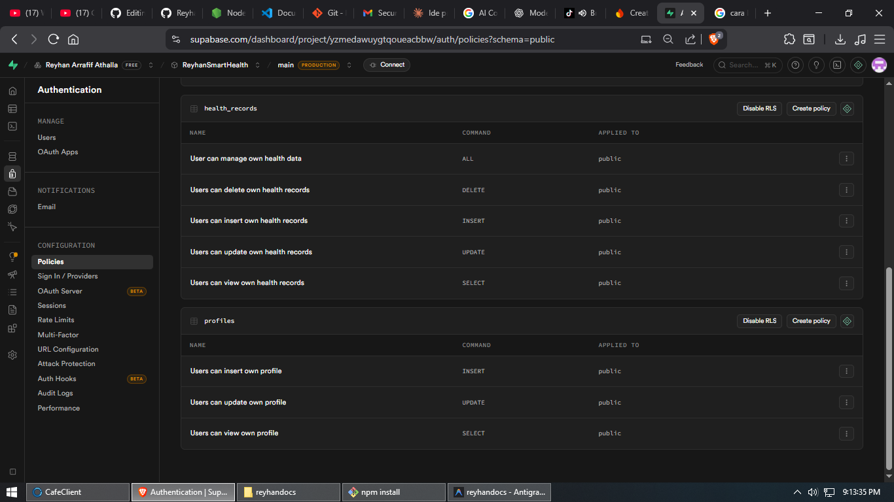

# ReyhanSmartHealth 🏥

Aplikasi kesehatan cerdas berbasis AI untuk transformasi layanan kesehatan dengan analisis data kesehatan personal dan rekomendasi gaya hidup.


---

## 🌐 Live Demo
Cobalah aplikasi ini secara langsung:

### 🧠 Catatan untuk Reviewer
Fitur Wawasan AI akan aktif secara optimal setelah minimal **3 data kesehatan** dimasukkan.  
Hal ini karena sistem menganalisis **pola dan tren**, bukan satu data tunggal, demi menjaga akurasi dan etika penggunaan AI.


### 👉 [KLIK DISINI UNTUK MEMBUKA WEBSITE](https://reyhanarrafifathalla-smart-health.vercel.app/)

---

## 📸 Tampilan Aplikasi

### 🔐 Register & Login

| **Register** | **Login** |
| :---: | :---: |
|  | 


### 🏠 Dashboard & Ringkasan Kesehatan

| **Dashboard & Ringkasan Kesehatan** | |
| :---: | :---: |
|  | |


### 🧠 Wawasan AI & Analisis Pola

| **Analisis Mendalam AI** | **Tren Kesehatan** | 
| :---: | :---: |
|  |  |

| **Rekomendasi Personal** | |
| :---: | :---: |
|  | |


### 📝 Input Data Kesehatan Harian

| **Form Data Kesehatan** | **Form Data Kesehatan** |
| :---: | :---: |
|  | 


### 💬 Chatbot Kesehatan 

| **Health Chatbot** | |
| :---: | :---: |
| ! | |


### 👤 Profil Pengguna

| **User Profile** | |
| :---: | :---: |
| ! | |

### 🔐 Keamanan Data Pengguna (RLS)

| **RLS Security** | **RLS Security** |
| :---: | :---: |
|  | 

---

## 🌟 Fitur Utama

### ✅ Autentikasi Pengguna
- Register dan Login dengan Supabase Auth
- Proteksi route dengan authentication
- Manajemen session otomatis

### 📊 Dashboard Kesehatan
- **Conditional Rendering**: Tampilkan empty state jika belum ada data
- **Live Statistics**: Ringkasan data kesehatan terkini
- **Trend Charts**: Visualisasi 7 hari dan 30 hari menggunakan Recharts
- **Responsive Design**: Optimal di semua perangkat

### 💉 Input Data Kesehatan
Form lengkap untuk memasukkan:
- Detak Jantung (BPM)
- Durasi Tidur (Jam)
- Asupan Air (Gelas)
- Tingkat Stres (1-10)
- Tingkat Aktivitas (Menit)
- Mood Tracking (6 pilihan emoji)

### 🤖 AI-Powered Insights
Analisis berbasis **rule-based AI** (tanpa API eksternal):
- **Pattern Detection**: Deteksi pola tidur, hidrasi, stres, dll
- **Risk Prediction**: Prediksi risiko gaya hidup berdasarkan kombinasi faktor
- **Personalized Recommendations**: Rekomendasi yang disesuaikan dengan data pengguna
- **Early Warning System**: Peringatan untuk pola abnormal

### 💬 Health Chatbot
- Context-aware berdasarkan data kesehatan pengguna
- Menjawab pertanyaan tentang tidur, stres, aktivitas, dll
- Suggested questions untuk memudahkan interaksi
- Real-time chat interface

### 👤 User Profile
- Edit profil pengguna
- Tampilkan informasi akun
- Privacy-first design

### 🎨 UI/UX Modern
- **Healthcare SaaS Design**: Clean, professional, dan modern
- **Dark & Light Mode**: Toggle tema dengan smooth transition
- **Gradient Themes**: Teal dan blue untuk nuansa kesehatan
- **Smooth Animations**: Fade-in, slide-up, dan micro-interactions
- **Responsive**: Mobile-first design

### 🔒 Privacy & Security
- Row-Level Security (RLS) di Supabase
- Data hanya bisa diakses oleh pemiliknya
- Disclaimer medis yang jelas di setiap halaman

## 🛠️ Tech Stack

### Frontend
- **React 18.2** - UI Library
- **Vite 5.0** - Build tool & dev server
- **Tailwind CSS 3.3** - Utility-first CSS framework
- **Recharts 2.10** - Chart library
- **React Router 6** - Client-side routing
- **Lucide React** - Icon library

### Backend
- **Supabase** - Backend as a Service
  - PostgreSQL database
  - Authentication
  - Row-Level Security
  - Real-time subscriptions (opsional)

### AI Logic
- **Internal Rule-Based System** - Pattern analysis & insights
- **No external AI APIs required**

## 📦 Installation

### Prerequisites
- Node.js (v16 atau lebih baru)
- npm atau yarn
- Akun Supabase (gratis)

### 1. Clone atau Extract Project

```bash
cd reyhansmartHealth
```

### 2. Install Dependencies

```bash
npm install
```

### 3. Setup Supabase

#### A. Buat Project di Supabase
1. Kunjungi [https://supabase.com](https://supabase.com)
2. Buat akun gratis (jika belum punya)
3. Klik "New Project"
4. Isi nama project, database password, dan region
5. Tunggu project selesai dibuat (~2 menit)

#### B. Dapatkan Credentials
1. Di dashboard Supabase, klik "Settings" → "API"
2. Copy **Project URL** dan **anon public key**

#### C. Jalankan Database Migration
1. Di dashboard Supabase, klik "SQL Editor"
2. Klik "New Query"
3. Copy seluruh isi file `supabase/migrations/schema.sql`
4. Paste ke SQL Editor dan klik "Run"
5. Verifikasi di "Table Editor" bahwa tabel sudah dibuat

### 4. Configure Environment Variables

Buat file `.env` di root project:

```bash
cp .env.example .env
```

Edit file `.env` dan isi dengan credentials Supabase Anda:

```env
VITE_SUPABASE_URL=https://your-project.supabase.co
VITE_SUPABASE_ANON_KEY=your-anon-key-here
```

### 5. Run Development Server

```bash
npm run dev
```

Aplikasi akan berjalan di `http://localhost:3000`

### 6. Build for Production

```bash
npm run build
```

Preview production build:

```bash
npm run preview
```

## 📂 Project Structure

```
reyhansmartHealth/
├── src/
│   ├── components/
│   │   ├── auth/              # Login & Register
│   │   ├── dashboard/         # Dashboard, Charts, Empty State
│   │   ├── health/            # Health Data Form
│   │   ├── ai/                # AI Insights Components
│   │   ├── chatbot/           # Health Chatbot
│   │   ├── layout/            # Main Layout & Navigation
│   │   ├── common/            # Reusable Components
│   │   └── profile/           # User Profile
│   ├── contexts/              # React Contexts (Auth, Theme)
│   ├── hooks/                 # Custom Hooks
│   ├── utils/                 # Utilities & AI Engine
│   ├── config/                # Supabase Client
│   ├── styles/                # Global CSS
│   ├── App.jsx                # Main App & Routing
│   └── main.jsx               # Entry Point
├── supabase/
│   └── migrations/            # Database Schema
├── public/                    # Static Assets
├── index.html                 # HTML Template
├── package.json               # Dependencies
├── vite.config.js             # Vite Configuration
├── tailwind.config.js         # Tailwind Configuration
└── .env                       # Environment Variables
```

## 🎯 Usage Guide

### First Time Setup
1. **Register**: Buat akun baru dengan email dan password
2. **Login**: Masuk dengan kredensial yang sudah dibuat
3. **Add Health Data**: Klik "Data Kesehatan" dan input data pertama Anda
4. **View Dashboard**: Kembali ke Dashboard untuk melihat statistik dan insights

### Daily Routine
1. Input data kesehatan setiap hari
2. Review AI insights dan rekomendasi di Dashboard
3. Gunakan Chatbot untuk bertanya tentang kesehatan Anda
4. Monitor tren mingguan dan bulanan via charts

### Understanding AI Insights
- **🟢 Success (Hijau)**: Metrik Anda dalam rentang sehat
- **🟡 Warning (Kuning)**: Ada area yang perlu ditingkatkan
- **🔴 Alert (Merah)**: Pola yang memerlukan perhatian segera

## ⚠️ Important Notes

### Medical Disclaimer
**Aplikasi ini BUKAN sistem diagnosis medis.** Semua wawasan dan rekomendasi bersifat:
- Informasi umum untuk gaya hidup sehat
- Berdasarkan analisis pola data
- Bukan pengganti konsultasi medis profesional

**Selalu konsultasikan dengan dokter untuk masalah kesehatan serius.**

### Data Privacy
- Semua data kesehatan disimpan dengan aman di Supabase
- Row-Level Security memastikan hanya Anda yang bisa akses data Anda
- Tidak ada sharing data dengan pihak ketiga

### AI Logic
- Menggunakan **rule-based pattern analysis**
- Tidak memerlukan API key eksternal (OpenAI, Gemini, dll)
- Semua analisis dilakukan di client-side
- Akurat untuk trend detection dan lifestyle recommendations

## 🚀 Future Enhancements (Optional)

- [ ] Export data kesehatan ke PDF/CSV
- [ ] Integrasi dengan wearable devices (Fitbit, Apple Watch)
- [ ] Notifikasi reminder untuk input data harian
- [ ] Goal setting & progress tracking
- [ ] Social features (share progress dengan keluarga)
- [ ] Multi-language support
- [ ] PWA (Progressive Web App) untuk offline access
- [ ] Advanced analytics dengan machine learning

## 🤝 Contributing

Jika Anda ingin berkontribusi:
1. Fork repository ini
2. Buat feature branch (`git checkout -b feature/AmazingFeature`)
3. Commit changes (`git commit -m 'Add some AmazingFeature'`)
4. Push ke branch (`git push origin feature/AmazingFeature`)
5. Buat Pull Request

## 📝 License

Project ini dibuat untuk tujuan pembelajaran dan demonstrasi.

## 📧 Support

Jika ada pertanyaan atau masalah:
- Buat issue di repository
- Email: support@reyhansmartHealth.com (contoh)

---

**Built with ❤️ for better health awareness**

🏥 ReyhanSmartHealth - Kesehatan Cerdas Berbasis AI
